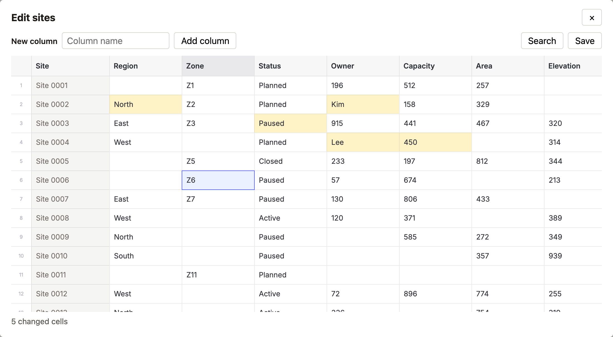

# Glide Data Grid bulk editor

An editable [Glide Data Grid](https://github.com/glideapps/glide-data-grid) that tracks every
change by row ID, handles paste itself, and saves everything in one request.



**Live example:** https://bflip12.github.io/glide-grid-bulk-editor/  
**Write-up:** [How to Build an Editable Spreadsheet with Glide Data Grid](TODO-article-url)  
**Guided demo:** [Glide Data Grid Bulk Editor](TODO-demo-url)

## The problem

Glide Data Grid draws cells on a canvas, so it stays fast with tens of thousands of cells.
It identifies a cell by its position on screen, `[col, row]`, and leaves your data to you.

If you store edits by that position, they follow the position instead of the data. Filter
the grid and the rows move: an edit stored as "row 2" now points at a different row, and
the save writes the value there.

## The approach

Key everything by row ID. Use Glide's row index only to look the ID up.

1. Values live in `columns[i].values[rowId]`. The rows on screen are a derived list,
   `visibleRowIds`, and row N on screen is `visibleRowIds[N]`
   ([`getVisibleRowIds`](src/hooks/grid-editor/utils/getVisibleRowIds.ts)).
2. Edits go into a change map, column ID to row ID to new value, with one entry per cell.
   An edit that puts a cell back to its saved value removes the entry
   ([`addChangesToMap`](src/hooks/grid-editor/utils/addChangesToMap.ts)).
3. Paste is handled in `onPaste`, which returns `false` so Glide does not apply it again.
   A first row that repeats the column titles is skipped as a header row, and the paste is
   size-checked before anything changes
   ([`getPasteChanges`](src/hooks/grid-editor/utils/getPasteChanges.ts),
   [`isHeaderRow`](src/hooks/grid-editor/utils/isHeaderRow.ts)).
4. New columns are added unsaved. Removing one removes its pending edits
   ([`gridEditorReducer`](src/hooks/grid-editor/gridEditorReducer.ts)).
5. One request saves the new columns and every changed cell. Only what the server accepted
   is marked as saved, so edits made during the request stay pending
   ([`buildSaveRequest`](src/hooks/grid-editor/utils/buildSaveRequest.ts),
   [`useGridSave`](src/hooks/grid-editor/useGridSave.tsx)).

State lives in a reducer shared through context. Visible rows, the change count, and the
save request are derived in the provider, never stored.

## Usage

```tsx
<GridEditorProvider initialData={{ idColumnTitle: "Site", rowIds, columns }}>
  <GridEditor height={460} onSave={(request) => api.save(request)} onRequestClose={close} />
</GridEditorProvider>
```

Or use the hooks with your own layout:

```tsx
const gridProps = useGlideGridProps({ onPasteRejected: showMessage });
const { save, isSaving, error } = useGridSave({ onSave });
const { isSearchOpen, closeSearch } = useGridKeyboard({
  isEnabled: true,
  hasSelection,
  onClearSelection,
  onEscapeWhenIdle: close
});

<DataEditor {...gridProps} showSearch={isSearchOpen} onSearchClose={closeSearch} />;
```

Glide renders its cell editor into an element with the ID `portal`, so the page needs one:

```html
<div id="portal" style="position: fixed; left: 0; top: 0; z-index: 9999"></div>
```

### Keyboard inside a modal

`useGridKeyboard` makes Ctrl+F (Cmd+F on macOS) open the grid's search instead of the
browser's find, which cannot search a canvas. Escape closes one thing at a time: the search,
then the cell editor, then the selection. Only when nothing is open does it call
`onEscapeWhenIdle`. The listener runs in the capture phase, before the grid or the modal
sees the key.

## Run it

```bash
npm install
npm run dev        # example app: 1,000 rows by 25 columns
npm test           # Vitest + React Testing Library
npm run build      # type-check and production build
```

## Files

```
src/
  hooks/grid-editor/
    gridEditor.types.ts
    gridEditorReducer.ts         every state change: edits, columns, filters, saved
    GridEditorContext.tsx        provider, derived values, useGridEditor
    useGlideGridProps.tsx        columns, getCellContent, onCellsEdited, onPaste for Glide
    useGridSave.tsx              one request, size check, clear on success
    useGridKeyboard.tsx          Ctrl+F and the Escape order
    utils/
      addChangesToMap.ts         one entry per cell, drops edits that match the saved value
      getVisibleRowIds.ts        column filters, in original row order
      getPasteChanges.ts         paste to row IDs, read-only column, header row
      isHeaderRow.ts
      validateColumnTitle.ts     required, no duplicates
      buildSaveRequest.ts, countChanges.ts, estimatePayloadBytes.ts
      *.test.ts
  components/grid-editor/
    GridEditor.tsx               toolbar, grid, change count
    AddColumnForm.tsx
    ColumnMenu.tsx               filters, remove unsaved column
  example/                       the editor in a modal, with sample data
```

## Background

This is a generalised reimplementation of an editor I built and shipped in a production
React and TypeScript app, where users edited about 25,000 cells of custom field values in a
modal. Names and data are changed. The design is the same, with a few gaps fixed: revert
detection, header-row detection by content, and cleanup of edits when an unsaved column is
removed.

Built with React 18, TypeScript, Glide Data Grid 6.0.3, Vite and Vitest.
